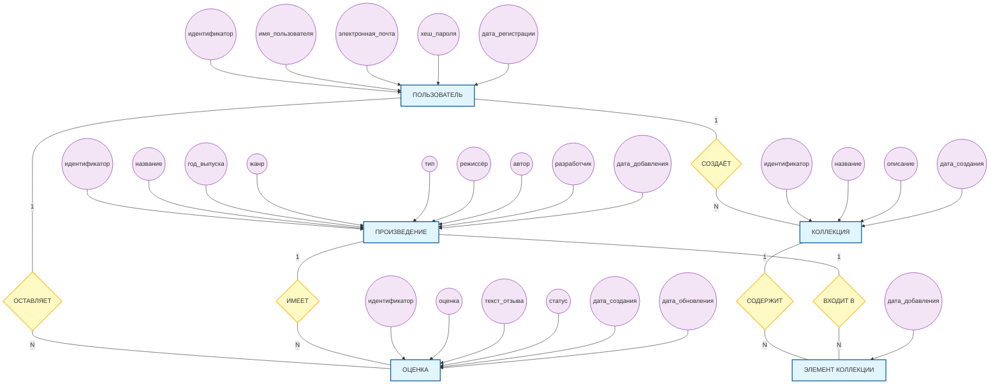

```mermaid

graph TD
    %% Стили
    classDef entity fill:#e1f5fe,stroke:#01579b,stroke-width:2px
    classDef relationship fill:#fff9c4,stroke:#fbc02d,stroke-width:2px
    classDef attribute fill:#f3e5f5,stroke:#7b1fa2,stroke-width:1px
    classDef cardinality fill:none,stroke:none,color:#d32f2f,font-weight:bold
    
    %% Сущности
    П[ПОЛЬЗОВАТЕЛЬ]:::entity
    Пр[ПРОИЗВЕДЕНИЕ]:::entity
    О[ОЦЕНКА]:::entity
    К[КОЛЛЕКЦИЯ]:::entity
    Эк[ЭЛЕМЕНТ КОЛЛЕКЦИИ]:::entity
    
    %% Связи-ромбы
    С1{ОСТАВЛЯЕТ}:::relationship
    С2{СОЗДАЁТ}:::relationship
    С3{ИМЕЕТ}:::relationship
    С4{СОДЕРЖИТ}:::relationship
    С5{ВХОДИТ В}:::relationship
    
    %% Связи с кардинальностью
    П --- |1| С1
    С1 --- |N| О
    
    П --- |1| С2
    С2 --- |N| К
    
    Пр --- |1| С3
    С3 --- |N| О
    
    К --- |1| С4
    С4 --- |N| Эк
    
    Пр --- |1| С5
    С5 --- |N| Эк
    
    %% Атрибуты ПОЛЬЗОВАТЕЛЯ
    А1((идентификатор)):::attribute --> П
    А2((имя_пользователя)):::attribute --> П
    А3((электронная_почта)):::attribute --> П
    А4((хеш_пароля)):::attribute --> П
    А5((дата_регистрации)):::attribute --> П
    
    %% Атрибуты ПРОИЗВЕДЕНИЯ
    А6((идентификатор)):::attribute --> Пр
    А7((название)):::attribute --> Пр
    А8((год_выпуска)):::attribute --> Пр
    А9((жанр)):::attribute --> Пр
    А10((тип)):::attribute --> Пр
    А11((режиссёр)):::attribute --> Пр
    А12((автор)):::attribute --> Пр
    А13((разработчик)):::attribute --> Пр
    А14((дата_добавления)):::attribute --> Пр
    
    %% Атрибуты ОЦЕНКИ
    А15((идентификатор)):::attribute --> О
    А16((оценка)):::attribute --> О
    А17((текст_отзыва)):::attribute --> О
    А18((статус)):::attribute --> О
    А19((дата_создания)):::attribute --> О
    А20((дата_обновления)):::attribute --> О
    
    %% Атрибуты КОЛЛЕКЦИИ
    А21((идентификатор)):::attribute --> К
    А22((название)):::attribute --> К
    А23((описание)):::attribute --> К
    А24((дата_создания)):::attribute --> К
    
    %% Атрибуты ЭЛЕМЕНТА_КОЛЛЕКЦИИ
    А25((дата_добавления)):::attribute --> Эк
    
    
```