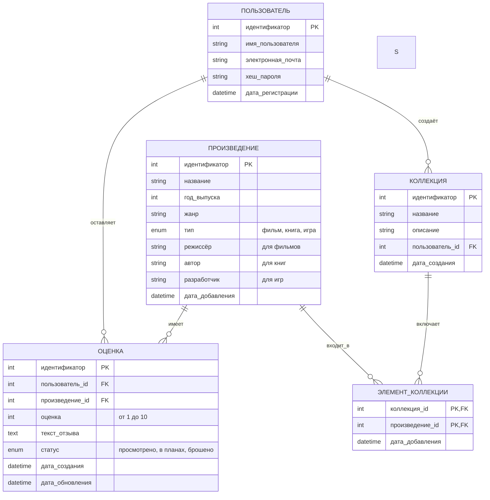

```mermaid

erDiagram
    ПОЛЬЗОВАТЕЛЬ ||--o{ ОЦЕНКА : оставляет
    ПОЛЬЗОВАТЕЛЬ ||--o{ КОЛЛЕКЦИЯ : создаёт
    ПРОИЗВЕДЕНИЕ ||--o{ ОЦЕНКА : имеет
    КОЛЛЕКЦИЯ ||--o{ ЭЛЕМЕНТ_КОЛЛЕКЦИИ : включает
    ПРОИЗВЕДЕНИЕ ||--o{ ЭЛЕМЕНТ_КОЛЛЕКЦИИ : входит_в

    ПОЛЬЗОВАТЕЛЬ {
        int идентификатор PK
        string имя_пользователя
        string электронная_почта
        string хеш_пароля
        datetime дата_регистрации
    }S

    ПРОИЗВЕДЕНИЕ {
        int идентификатор PK
        string название
        int год_выпуска
        string жанр
        enum тип "фильм, книга, игра"
        string режиссёр "для фильмов"
        string автор "для книг"
        string разработчик "для игр"
        datetime дата_добавления
    }

    ОЦЕНКА {
        int идентификатор PK
        int пользователь_id FK
        int произведение_id FK
        int оценка "от 1 до 10"
        text текст_отзыва
        enum статус "просмотрено, в планах, брошено"
        datetime дата_создания
        datetime дата_обновления
    }

    КОЛЛЕКЦИЯ {
        int идентификатор PK
        string название
        string описание
        int пользователь_id FK
        datetime дата_создания
    }

    ЭЛЕМЕНТ_КОЛЛЕКЦИИ {
        int коллекция_id PK, FK
        int произведение_id PK, FK
        datetime дата_добавления
    }
```